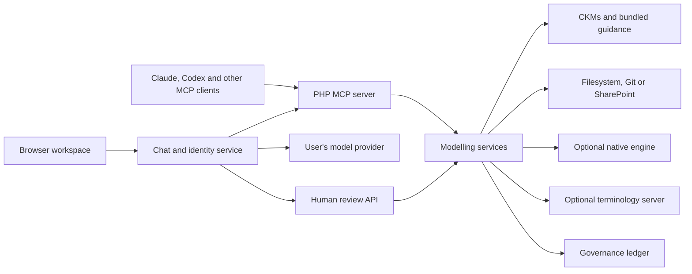

# openEHR and FHIR Modeller

Independently maintained and developed by Michael Anywar

Licensed under the [MIT License](LICENSE).

A self-hosted MCP server for openEHR modelling. Search CKMs, retrieve modelling
guidance, work with archetypes and templates, check ADL and AQL, and keep model
revisions and review history in a shared repository.

Connect Claude, Codex or another MCP client to the same `/mcp` endpoint. The optional
browser workspace brings chat, model browsing and human review together at `/chat/`.
A CDR and terminology server are optional.

## FHIR authoring extension (Dev)

This fork preserves the openEHR workspace and adds a distinct FHIR workspace for
R4, R4B and R5 package discovery, reuse analysis, FSH authoring, SUSHI compilation,
validation, synthetic examples, semantic comparison and explicit mapping proposals.
Shared Dev uses [GitHub image delivery](docs/FHIR_DEV_DELIVERY.md) and the
`dev-openehr-fhir-modeller.sandbox.hygeoniq.com` address.

The private FHIR engine is optional; see [Dev setup](docs/FHIR_DEV.md) and the
[FHIR workspace](docs/FHIR_WORKSPACE.md).

Git remains the engineering source. Use `CzarMich/fhir_ig` for FSH, generated
resources, examples, mappings and validation evidence. The existing
HYQ-FHIR-Governance-Platform (`CzarMich/hyq_fhir`) imports drafts and owns review,
publication and distribution. This modeller provides its authenticated adapter;
it does not host a second public catalogue or IG publishing service.

The new fork has no enabled production deployment path. Keep development changes
on feature branches until the user has tested and approved production promotion.

## Start locally

Requires Docker Engine and Docker Compose with `env_file.required` support.

```sh
git clone https://github.com/CzarMich/openehr_FHIR_Modeller.git
cd openehr_FHIR_Modeller
cp .env.example .env
docker compose up -d --build
curl http://127.0.0.1:8343/health
curl http://127.0.0.1:8343/ready
```

Connect your MCP client to `http://127.0.0.1:8343/mcp`. The default listener is local
and unauthenticated. For a hosted installation, configure authenticated HTTPS using
the [deployment guide](docs/DEPLOYMENT.md).

- [Connect Claude, Codex or another client](docs/MCP_CLIENTS.md)
- [Configure browser chat](docs/BROWSER_CHAT.md)
- [Browse models and review changes](docs/BROWSER_WORKSPACE.md)
- [Installation and configuration](docs/install.md)

## Modelling tools

- Search one or more CKMs and retrieve archetypes or templates with source identifiers.
- Read bundled specifications, guides, examples and terminology.
- Use prompts for archetype, template, ADL, AQL and simplified-format design and review.
- Create draft OET templates from retrieved archetypes.
- Check document structure, compare models and run project quality checks.
- Store projects and immutable model revisions in filesystem, Git or SharePoint repositories.
- Preserve imported originals, provenance and requirements linked to exact revisions.
- Maintain terminology catalogues and binding plans; optionally query a FHIR terminology server.
- Prepare models for human review and record authenticated decisions in an audit ledger.

The optional [native engine](docs/OPT_COMPILATION.md) validates ADL 2, parses AQL
and compiles ADL 2 templates to OPT 2. It also compiles the
[supported OET/ADL 1.4 profile](docs/LEGACY_OPT_COMPILATION.md) to OPT 1.4 XML.
The [AQL workspace](docs/CDR_WORKSPACE.md) checks paths against selected templates
and runs read-only queries against private CDR connections. Full OET coverage and
visual model editing remain incomplete. See the [capability matrix](CAPABILITIES.md) for the scope of each feature.

- `guide_get` returns the **full** guide file.
- Model writes require `MODEL_REPOSITORY_WRITE_ENABLED=true` and the configured write permissions.
- Browser writes require confirmation of the proposed change.
- Clinical approval requires an independent authorised reviewer and qualified validation.
  Saving a draft or compiling a template does not grant approval.

Tool signatures, schemas and examples are in the [tool catalogue](docs/MCP_TOOLS.md).
The [MCP protocol profile](docs/MCP_PROTOCOL.md) describes supported transports and capabilities.

## Architecture



The PHP server supplies modelling operations independently of any model provider.
The browser service and external clients use the same MCP tools. Human decisions
use a separate authenticated review API. [Architecture](docs/ARCHITECTURE.md),
[identity](docs/IDENTITY_AND_ACCESS.md) and [security](docs/SECURITY.md) describe the boundaries.

For worked examples, see the [shared Git workflow](docs/workflows/shared-git-models.md)
and [neonatal modelling workflow](docs/workflows/neonatal-admission.md).
The [documentation index](docs/README.md) links to repository, terminology, import
and governance guides.

## Development

```sh
make env
make build-dev
make install
make ci
make conformance
```

Run PHP and Composer in Docker. `make ci` checks traceability, PHPStan and PHPUnit;
`make conformance` checks HTTP and stdio against the product's advertised MCP profile.
Browser checks and optional integration probes are documented in [testing](docs/testing.md).
Read [CONTRIBUTING.md](CONTRIBUTING.md) before submitting changes.

## Licensing

The project is licensed under the [MIT License](LICENSE), with copyright notices
for the upstream authors and Michael Anywar's original work. Separately licensed
third-party material retains its respective terms. Required notices are contained in
[THIRD_PARTY_NOTICES.md](THIRD_PARTY_NOTICES.md).
