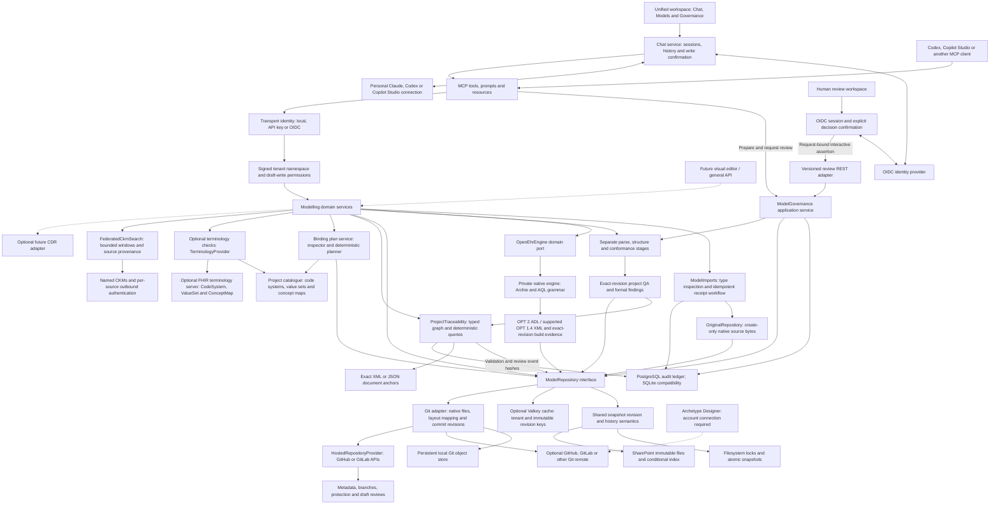

# Architecture

openEHR Modelling Assistant is a PHP 8.4 application. MCP and a versioned human review REST API adapt shared application services; the modelling domain has no Microsoft, Claude, OpenAI, GitHub, GitLab or Graph SDK dependency. Clients supply the language model and orchestration. The application provides deterministic retrieval, persistence and bounded checks.

Solid edges are implemented; dotted edges are extension boundaries. `src/Domain` owns modelling, terminology, traceability and repository contracts. `src/Integrations` implements filesystem, Git, SharePoint and FHIR adapters. Snapshot stores share domain revision/history rules. SharePoint uses a unique project index and ETag-conditional pointer updates; outbound Graph credentials are independent of inbound identity. The generic Git adapter supports hosted GitHub/GitLab repositories without a hosting-provider SDK. Optional hosting adapters implement `HostedRepositoryProvider`; `src/Application/RepositoryService` supplies transport-independent operations and write authorization. Hosted metadata is scoped to the configured tenant repository; draft reviews cannot approve clinical models. The dotted Designer edge represents an account-specific integration that still needs a hosted Designer round-trip acceptance test. `src/Apis` implements CKM retrieval. `src/Tools` adapts domain calls to closed MCP schemas. `public/index.php` supplies authentication, transport, discovery, sessions and redacted logging.

The HTTP path is enterprise TLS gateway → Caddy → private PHP-FPM → MCP handler. stdio uses the same discovery and domain services with local process permissions. CDR credentials and terminology-server configuration are unnecessary for startup, retrieval, draft generation, persistence or local structural validation. Models need no terminology binding. An explicitly requested external terminology check returns `NOT_EXECUTED` when no server is configured; local value sets remain usable.

The project terminology catalogue uses the shared repository contract for conditional DRAFT saves, history, canonical/edition identity and malformed-record findings. Pure local operations require no external server. Explicit external references delegate to the domain terminology/mapping provider interfaces with their recorded edition.

Terminology operations preserve repeated multilingual values and separate value-set, code-system and ConceptMap version evidence. Translation returns explicit candidates requiring review; canonical discovery and operation calls remain pinned to the configured FHIR endpoint. Native binding application is still an engine extension.

Model files, local value sets, binding records, requirements and decisions share one repository. Select `filesystem` for atomic JSON project snapshots, or `git`/`github`/`gitlab` for ordinary model files, Git commits and optional remote synchronization. Both use expected revisions to reject stale updates. Git fetches before writes and accepts a commit locally only after its remote push succeeds; a rejected push leaves the accepted local branch unchanged. Each instance needs its own Git cache. Native OIDC partitions local storage by issuer/tenant and maps separate Git remotes per tenant. API-key mode remains a shared service principal. Automatic conflict merge, distributed locking and a search index are separate work.

XML/JSON parsing is deterministic and separate from document structure. OET/OPT and FLAT/STRUCTURED profiles, exact-revision project QA and formal findings are implemented; ADL checks inspect its header. The optional [native engine](OPT_COMPILATION.md) adds ADL 2/AOM/RM validation, AQL syntax parsing and ADL 2-to-OPT 2 compilation. A separate [OET compatibility profile](LEGACY_OPT_COMPILATION.md) adds OPT 1.4 XML compilation and schema/RM structure checks. Complete legacy semantics remain separate work. The optional [AQL/CDR subsystem](CDR_WORKSPACE.md) adds exact-template path checks and explicit read-only remote query execution through a provider-neutral adapter. [Validation and QA](VALIDATION_AND_QA.md) records each boundary. QA records its unexecuted stages as NOT_EXECUTED and keeps release eligibility false; an independent AQL run does not qualify a model for release. The installed validation executor records authoritative evidence in the governance ledger. Its incomplete stages prevent approval/publication. An AI-supplied report or approval field cannot bypass that gate.

Source selection and outbound credentials are deployment-controlled. The CKM domain port isolates shared federated aggregation from its configured integration; credentials never appear in source discovery. Each CKM tool accepts a configured source name; it cannot accept an arbitrary destination URL. See [configuration](CONFIGURATION.md), [repository](MODEL_REPOSITORY.md), [terminology](TERMINOLOGY.md), [governance](GOVERNANCE.md), and the [capability matrix](../CAPABILITIES.md).

The optional [browser chat](BROWSER_CHAT.md) is a separate Node MCP client with personal Claude, Codex and [Copilot Studio](COPILOT_BROWSER.md) connections. It keeps provider/MCP credentials server-side and requires exact-change confirmation for repository writes. Browser OIDC authenticates chat users independently of native MCP bearer verification; neither boundary yet supplies project-level RBAC. Conversation storage is private to each signed-in identity, while the configured model repository may be shared.

The [binding-plan application service](TERMINOLOGY_BINDING_PLANS.md) combines a domain inspector interface, an XML adapter and a pure membership planner. It preserves source bytes, records source/catalogue revisions, exposes unresolved choices, and recomputes evidence freshness. It never applies native bindings or approves a clinical model. Native inherited semantics remain an engine boundary.

The [human review adapter](GOVERNANCE.md) uses the same `ModelGovernance` application service as MCP preparation tools. Clinical decisions require a distinct interactive browser identity, configured role and explicit exact-revision confirmation. The browser backend creates a short-lived assertion bound to method, target, body and a durable single-use nonce. It uses a dedicated key that is absent from model-worker environments. Native bearer/API-key credentials never establish human identity.

The authoritative lifecycle and governance validation evidence live in a separate PostgreSQL ledger (SQLite compatibility remains available), independently of editable repository metadata. Transactions enforce audit-sequence compare-and-swap; hash chains and database triggers detect changes and prohibit application-level edits/deletes. Root storage administration remains a trust boundary. Model repository and ledger writes are not a distributed transaction; every decision records its exact observed revision and never approves newer content. See [review deployment](REVIEW_DEPLOYMENT.md) for storage, roles, rotation and backup limits. The default browser image supports human review without a provider runtime; conversational chat is an explicit optional target.

The [requirements graph](REQUIREMENTS_TRACEABILITY.md) stores typed requirement/decision/model links through `ModelRepository`. `Domain/Traceability/Graph` owns bounded validation and traversal; `ProjectTraceability` owns conditional persistence and queries; `TraceabilityEvidence` resolves pinned sources and exact audit events within the authenticated project/tenant. Document-anchor inspection sits behind a domain interface. XML/JSON locations resolve deterministically; native inherited paths require the engine. Graph declarations remain separate from clinical satisfaction and release qualification. Repository/ledger snapshots are observed separately, and reads recompute freshness.

The [MCP adapter](MCP_PROTOCOL.md) selects supported protocol revisions and capabilities explicitly. Its wire acceptance is independent of clinical validation and repository policy.

Browser chat and model governance share one verified human session. Review browsing and decision freshness have separate bounded lifetimes; the explicit platform-administrator role maps to all governance roles. See [review deployment](REVIEW_DEPLOYMENT.md#one-browser-identity-for-chat-and-governance).

PostgreSQL is the recommended governance backend. Optional Valkey accelerates repeated model/template reads while source revisions remain authoritative. See [storage and cache deployment](POSTGRES_AND_CACHE.md) for configuration, SQLite migration and recovery.

The main browser URL now opens one [tabbed modelling workspace](BROWSER_WORKSPACE.md). Chat, repository browsing and governance share navigation and sign-in; switching tabs preserves the conversation and selected revision.

The legacy engine pairs Archie-calculated original model paths with original ADL constraint syntax. It expands supported internal references without modifying source archetypes and narrows omitted/open RM attributes using bundled RM metadata. Each transformation is recorded in build actions; cycles, type mismatches and explicit slot restrictions remain enforced. Existing-model compilation is exercised by `scripts/engine-example-smoke.py`.

[Manual imports](MODEL_IMPORTS.md) separate byte-preserving originals from editable models and compiler outputs. Protected intent/receipt streams bind the transport principal to exact stored hashes and revisions. Governance filters registration streams before pagination; ordinary model writes cannot mutate the original namespace. External source claims and detected types never certify external-tool origin or clinical validity.
