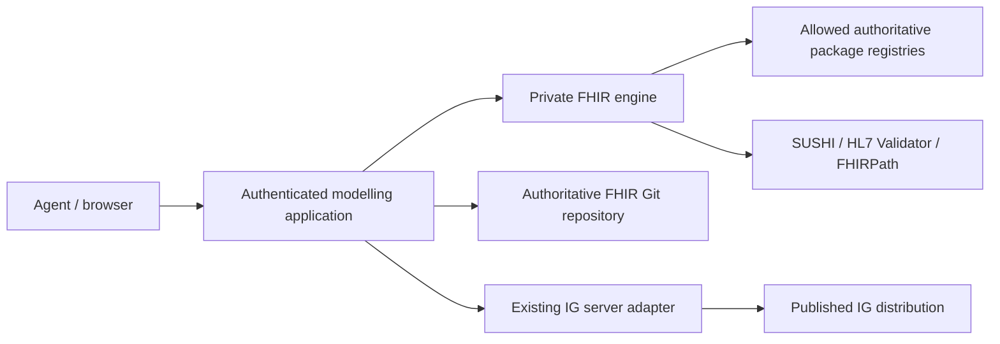

# Private FHIR modelling engine

The FHIR provider is an independent Node/Java service in `fhir/`. It supplies
package discovery, modelling, compilation, comparison and validation to the PHP
application. Existing openEHR processing remains separate. The service is **not an
IG server, public profile catalogue, publication endpoint or runtime FHIR server**.
The existing HYQ FHIR Governance Platform remains the publication and distribution
authority. Git preserves authored FSH and engineering history.



## Service contract

`GET /health` reports service/tool versions and `toolsReady`. It returns 503 when
the pinned validator JAR is missing/corrupt, required npm versions are absent, or
Java 21 cannot start. Checks run once at process startup; recreate the container
after repairing its toolchain. Application readiness includes this private check.
`POST /execute` requires
`Authorization: Bearer <internal token>` and `Content-Type: application/json`:

```json
{
  "operation": "profile.discover",
  "tenant": "authenticated-user-or-organisation-id",
  "parameters": {
    "project": {
      "name": "Research laboratory",
      "fhirVersion": "4.0.1",
      "canonical": "https://example.org/fhir/research",
      "packageId": "org.example.research",
      "version": "0.1.0",
      "publisher": "Example organisation",
      "jurisdiction": "DE",
      "dependencies": [],
      "sources": []
    },
    "requirement": "Represent laboratory results for the research project",
    "baseResource": "Observation"
  }
}
```

The PHP application supplies authenticated tenant identity. Browser/model input
cannot set the engine's deployment configuration. Errors use
`{"error":{"code":"...","message":"..."}}` with an appropriate HTTP status.
Exported `execute(operation, parameters, context)` supports deterministic tests.

| Operation | Additional parameters | Result |
| --- | --- | --- |
| `package.search` | `query` | Installed configured dependency graph (`items`, `total`) |
| `package.get` | `id`, optional `version`, `source` | Registry version metadata, or exact installed package |
| `package.install` | `id`, `version`, optional `source` | Installed package, archive hash and transitive lock |
| `package.dependencies` | none | Exact dependency graph and fingerprint |
| `package.artifacts` | `query`, `resourceType`, `baseResource`, `parent`, `canonical`, `terminology`, `id` (package), `offset`, `limit` | Search index (`items`, `total`) |
| `package.resolve` | `canonical`, optional artifact `version`, package `id` | Original resource and source provenance; conflicts fail |
| `artifact.inspect` | `content` (FHIR JSON text or object) | Identity, elements, bindings, invariants and canonical references |
| `artifact.diff` | `before`, `after`, optional `dependents` | Semantic changes, conservative compatibility and dependency impact |
| `artifact.validate` | `content`, optional `profiles` (StructureDefinition objects), `profile` (canonical) | Actual validator result, OperationOutcome and tool evidence |
| `profile.discover` | `requirement`, `baseResource`, optional `constraints`, `projectArtifacts` | Ranked candidates, reasons, reuse proposal and dependency lock |
| `profile.generate` | Discovery parameters plus `id`, `name`, `description`, optional `title`, `parentCanonical`, `parentRationale`, `derivationJustification` | Authored FSH, element traceability and source lineage |
| `fsh.compile` | `files: [{path, content}]` | Generated files, diagnostics, input hashes and SUSHI evidence |
| `fhirpath.validate` | `expression` | Real library syntax/compilation result |
| `fhirpath.evaluate` | `expression`, `content`, optional `variables` | Evaluation results and invariant boolean |
| `examples.generate` | `content` (profile), optional `id`, `values` keyed by element path | Synthetic JSON example, unresolved required fields and provenance |
| `mapping.analyse` | `source: {artifact, version, elements}`, `baseResource`, optional `requirement`, explicit `mappings` | Provisional mappings, semantic gaps and discovery evidence |

All operations require explicit project `fhirVersion`: `R4`/`4.0.1`,
`R4B`/`4.3.0`, or `R5`/`5.0.0`. Artifacts and packages from another release are
rejected. Missing package compatibility declarations are not guessed. Package
versions must be exact; `latest`, ranges, `current` and `dev` are rejected. Registry
metadata discovery is separate from resolving/persisting a chosen version.

The current authoring interchange is FHIR JSON and FSH. Original XML can remain
in the application's artifact store, but this engine does not claim XML inspection
or validation support. Generic FSH accepts profiles, extensions, logical models,
terminology, conformance resources and instances supported by pinned SUSHI. Typed
profile orchestration currently creates constrained profiles.

## Reuse and source policy

Declare preferred sources at project level:

```json
{
  "sources": [
    {"id":"national-mii","url":"https://packages.fhir.org","priority":"national","jurisdiction":"DE"}
  ],
  "dependencies": [
    {"id":"de.medizininformatikinitiative.kerndatensatz.laborbefund","version":"2026.0.1","source":"national-mii"}
  ]
}
```

This is an optional national-source configuration, not a global Germany default.
MII/ISiK/IPS/WHO and organisation packages use the same exact-version mechanism;
select their applicable packages and versions from their publishers. Configuring
an origin is not proof of the publisher's authority; project governance must choose
trusted sources and suitable jurisdiction.

Discovery ranks project, organisation, national, international and core sources,
then adds explainable lexical relevance, jurisdiction and existing-use scores.
It reports an empty preferred source and continues the configured fallback order.
Ranking is **not clinical equivalence**. A natural-language agent must supply the
base resource and structured requirements; the service does not infer clinical
semantics from names alone. Review original candidate constraints and terminology.

`profile.generate` reruns discovery, resolves the parent from the exact graph and
preserves its hash/package/version. No added constraints produces a reuse
recommendation instead of a duplicate profile. A justified administrative
local derivation requires an explicit `derivationJustification`. Selecting another
parent requires `parentRationale`.

Example typed constraints:

```json
[
  {"path":"Observation.subject","min":1,"source":{"kind":"requirement","id":"REQ-12"}},
  {"path":"Observation.value[x]","types":["Quantity"],"mustSupport":true,"source":{"kind":"project-policy"}},
  {"path":"Observation.code","binding":{"strength":"required","valueSet":"https://example.org/ValueSet/laboratory-codes|1.0.0"},"source":{"kind":"terminology-source"}},
  {"path":"Observation.status","fixed":{"type":"code","value":"final"},"source":{"kind":"requirement","id":"REQ-13"}}
]
```

Supported fields include cardinality, datatypes, reference targets, bindings,
Must Support, modifier flags, fixed/pattern values, slicing/discriminators,
slices, invariants and reused extension references. An extension reference needs
justification. An omitted constraint source is explicitly `agent-derived`.
Unsupported fields and unsafe paths fail. SUSHI and the validator determine whether
constraints are legal against the selected parent; generation alone does not.

## Compilation and validation

Pinned tools are SUSHI **3.20.1**, HL7 FHIR Validator **6.10.4** and fhirpath.js
**5.2.0**. `package-lock.json` fixes all npm transitive dependencies. The validator
JAR is SHA-256 checked before execution:
`1106b9d58f9e363e47bea7c4fc065841e5fc91fe9d062775c3bfdd212bd653cc`.
Upstream dependency license metadata stays in the installed packages/JAR.

`fsh.compile` accepts safe files under `input/fsh/`, `input/resources/` and
`input/examples/`. The service writes `sushi-config.yaml` from project settings,
uses isolated caches containing locked packages, runs SUSHI with snapshots and
returns generated JSON. Authored FSH remains separate. No caller-controlled shell,
executable, command arguments or arbitrary output paths are accepted. A nonzero
exit, timeout or error diagnostic fails compilation and withholds partial outputs.

`artifact.validate` invokes the real HL7 Java validator against the selected
release, locked dependencies and supplied custom profiles. It captures exit code,
stdout/stderr, errors/warnings, input hashes, profile canonical and package lock.
An absent output, crashed/missing tool or timeout is not a successful validation.
`valid`/`success` describe that validator run; `publicationReady` additionally
requires a configured, successfully available terminology service. Default offline
terminology is explicitly `not-run`, so it cannot silently authorize publication.
Clinical review and example evidence remain additional application governance
requirements.

`FHIR_TERMINOLOGY_URL` and `FHIR_TERMINOLOGY_ORIGINS` are administrator-owned
configuration. The validator uses the configured service when present; an
authenticated terminology deployment can provide an internal authenticated proxy.
Credentials are not accepted in model/project arguments or embedded in URLs.

Examples are synthetic, use supplied values and profile fixed/pattern constraints,
and report gaps instead of inventing clinical codes, units or references. Submit
each generated example to `artifact.validate` with `profiles` and the intended
`profile` canonical. A generated example is unvalidated until that call succeeds.

FHIRPath executes in a bounded worker with the release-specific library model.
R4B model data is generated using the pinned library's own extractor and exact
R4B core package, rather than substituting R4. Expressions cannot resolve remote
references or contact terminology services. Network-dependent checks belong in
the configured adapters/validator.

## Semantic comparison and mappings

Comparison covers cardinalities, types/reference targets, bindings, slicing,
Must Support, extension profiles, fixed/pattern values, invariants and canonical
references. It also reports terminology compose/concept changes. Snapshots compare
effective elements; differential comparisons clearly report incomplete inherited
context. Classifications are conservative guidance: informational, compatible,
potentially breaking or breaking. They are not a clinical safety certificate.

Supply local dependent resources to compute transitive affected canonicals after
an upgrade. The engine recommends revalidation/review and never rewrites dependents.
Mapping analysis accepts inspected source elements and explicit proposed relations
(equivalent, narrower, broader, transformed, conditional, no-direct-equivalent).
It records gaps, versions, transformations, provenance and proposed status.
Equivalence needs justification and remains subject to human review. No automatic
lossless openEHR/FHIR conversion is claimed. Original source models are unchanged.

## Security and operation

Set `FHIR_ENGINE_TOKEN_FILE` to an absolute mounted secret file (preferred), or
`FHIR_ENGINE_TOKEN` to a secret of at least 32 characters. Only the authenticated
application calls the private service. Do not publish port 8094 to public ingress.
`FHIR_DATA_DIR` defaults to `/data/fhir`; storage is partitioned by a SHA-256 tenant
key. Tool jobs receive a minimal environment and private temporary directories.

`FHIR_PACKAGE_ORIGINS` is a comma-separated administrator allowlist, defaulting to
`https://packages.fhir.org,https://packages2.fhir.org,https://packages.simplifier.net`.
Downloads require HTTPS, reject credentials/redirects/private DNS targets and have
compressed/expanded size limits. Archive traversal, duplicate entries, links and
special files are rejected. Package indexes include original file paths, exact
versions, canonicals and hashes. Source origin/version/release are part of cache
identity. Ambiguous canonicals require explicit version/package selection.

Requests are limited to 12 MB; resources to 5 MB; compilation sources to 10 MB/200
files; dependency graphs to 150 packages; archives to 60 MB compressed/250 MB
expanded. At most two requests execute concurrently. Tool output, CPU time and
FHIRPath worker memory/time are bounded. Persistent cache storage requires the
operator's normal volume quota and retention policy.

Build from the repository root with `docker build -f fhir/Dockerfile -t
openehr-fhir-engine:dev .`. Run `npm ci --ignore-scripts` and `npm test` in the
FHIR development container or a Node 22 tooling environment. `npm run
test:acceptance` executes real tool acceptance and writes a local JSON evidence
artifact under `fhir/acceptance-export/`; it requires the pinned validator and
authoritative package downloads. The suite authors and compiles a synthetic R4
Patient profile, validates it and a conforming example, rejects an intentionally
invalid example, then checks FHIRPath and a breaking semantic change. It never
publishes. `FHIR_ACCEPTANCE_PACKAGES` may point at an operator-preloaded directory
of original `<package-id>#<version>.tgz` registry archives; this test-only transport
is unavailable through the HTTP API. Package identity, compatibility, hashes and
dependency checks still run. The normal image caches the checked validator in a
separate build layer so source changes do not download it repeatedly.

Common failures: an unpinned/conflicting dependency needs an explicit version
choice; an unknown canonical needs the correct compatible dependency; SUSHI may
require a source package snapshot; a missing validator must be installed with the
pinned checksum; unavailable external terminology leaves publication blocked.

## Authoritative references

- [FHIR package format](https://hl7.org/fhir/packages.html)
- [FHIR R4 ElementDefinition](https://hl7.org/fhir/R4/elementdefinition.html)
- [SUSHI project and command documentation](https://fshschool.org/docs/sushi/)
- [HL7 validator source and releases](https://github.com/hapifhir/org.hl7.fhir.core)
- [HL7 FHIRPath JavaScript implementation](https://github.com/HL7/fhirpath.js)
- [MII authoritative dataset/module overview](https://www.medizininformatik-initiative.de/de/der-kerndatensatz-der-medizininformatik-initiative)
