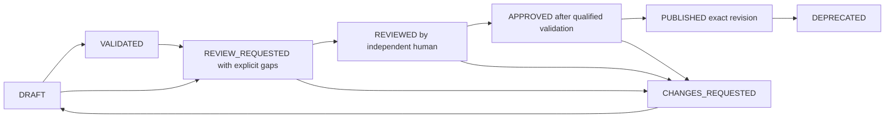

# Modelling governance and evidence

The platform persists lifecycle decisions for **an exact model revision** in an authoritative audit ledger. AI/MCP clients can prepare a revision, run deterministic checks and request review. Clinical review, approval, publication and deprecation require a separately authenticated browser session and the appropriate human role. Normal MCP API keys and delegated OIDC access tokens cannot approve models.

Open `/chat/reviews` to inspect source content, validation evidence and history. Choose an available action, enter a review comment, and confirm the displayed revision and validation digest. The browser review workspace works with chat disabled and needs no model-provider account.

## Lifecycle and validation gates

A deterministic validation run records evidence and sets DRAFT or VALIDATED. New validation evidence requires another review. The current structural preflight reports missing qualification stages, so it **cannot make a model eligible for approval or publication**. Unit tests use an explicitly synthetic qualified executor to verify the approval policy; the production application has no switch that accepts caller-supplied passing reports.

Approval requires passing parse, structure, semantics, openEHR conformance, repository policy and requirements traceability stages. Dependency and terminology checks must pass or explicitly record why they do not apply. NOT_EXECUTED, missing, duplicated and unqualified stages block approval. Terminology remains optional when no applicable binding requires it.

The preparer is the authenticated transport identity that registered the revision. It is not an inferred original clinical author from imported metadata. Review/approval/publication must come from another authenticated identity with the required role. Source authorship and provenance still require the corresponding clinical and repository checks. In API-key mode, preparers share the service principal; native OIDC preserves subject and tenant identity.

| Action | Required identity/role | Additional gate |
|---|---|---|
| Prepare, validate, request review, reopen draft | Authorized modeller; service/agent allowed | Write enablement, current source and expected audit sequence |
| Record review or request changes | Interactive human reviewer | Distinct from registered preparer |
| Approve | Interactive human approver | REVIEWED state, independent actor, qualified evidence and explicitly confirmed validation digest |
| Publish | Interactive human publisher | APPROVED state and the same qualified evidence |
| Deprecate | Interactive human publisher | Previously PUBLISHED revision; historical revision can be deprecated |

PUBLISHED records the exact revision's lifecycle decision. It does not deploy a template to a CDR or create a signed release package. Model artefact metadata remains DRAFT; the governance ledger is the authority for lifecycle decisions. Old approval never approves newer content. A changed source needs a new registered review subject. State changes use compare-and-swap audit sequences, and a stale submission must be reread before retrying.

## Agent workflow

1. Save the model through the repository and retain its revision.
2. Call `governance_prepare(project, path, modelRevision, comment)`.
3. Call `governance_validate(subject, expectedSequence)` and read every executed/unexecuted stage.
4. Call `governance_request_review(subject, expectedSequence, comment)` to request review, with gaps explicit.
5. Read `governance_get` or `governance_list`. An agent may address requested changes and prepare the resulting source revision; it may not perform the human decision.

`governance_reopen_draft` only moves CHANGES_REQUESTED to DRAFT. There is no MCP approval or publication tool. Browser confirmation of a chat repository write is separate from a clinical governance decision.

## Audit storage and concurrency

`AuditStore` separates governance authority from editable model storage. The PostgreSQL and SQLite adapters store append-only events with actor, identity method, timestamp, previous/new state, source revision/hash, comment, validation digest, sequence and previous-event hash. SQL triggers prohibit normal update/delete operations. Reads verify the hash chain; competing writers cannot append the same sequence. Short-lived assertion nonces are consumed transactionally and remain effective across process restarts.

The ledger uses a separate `governance` volume at `/data/governance`. It is never mounted into a model worker or exposed as a `ModelRepository` path. Filesystem, Git and SharePoint model repositories use the same governance service. Model edits and ledger events are not a distributed transaction: a recorded decision always names the immutable observed revision, and reads recheck whether that revision is still current.

This provides application-level immutable history and corruption detection. An operating-system/database administrator can replace the database or reconstruct an entire chain; it is not a cryptographically signed external attestation. One authoritative ledger instance owns a namespace. Separate deployments have separate ledgers; do not assume that sharing a Git remote shares approvals. Distributed database replication and project/team-level ACLs remain separate capabilities.

Limits: 256 events per review subject, 64 KiB per event, 100 subjects per page, 10,000 outstanding short-lived assertion nonces. Limits fail explicitly. Large validation artefacts should become immutable build evidence referenced by digest through the qualified engine; the current preflight is bounded evidence, not a substitute for that engine.

## Browser authentication boundary

The browser uses verified OIDC authorization-code sessions, secure opaque cookies, PKCE, state, nonce, signature/issuer/audience/time checks and same-origin CSRF protection. Review roles come from a configured **signed ID-token claim**, not browser input. The browser backend creates a 60-second, single-use HS256 assertion bound to the request method, target and body digest. The core validates a dedicated token type, audience, issuer, key identifier, session age, roles, tenant and nonce.

A dedicated review signing key is shared only by the browser backend and core. It is distinct from the MCP key and OIDC credentials, and is excluded from the isolated model worker environment. These assertions are an internal application contract; they are not interchangeable with OIDC access/ID tokens. Authentication establishes the authorized browser session and explicit decision; it does not prove physical human presence against an administrator automating that account.

See [review deployment](REVIEW_DEPLOYMENT.md), [REST review contract](openapi/reviews.json), [OIDC](OIDC.md) and [ADR-0015](decisions/0015-persisted-governance-and-interactive-human-approval.md).

## Migration and verification

The previous unpersisted `Domain/Modelling/Governance` helper is replaced by `Domain/Governance/ReviewPolicy` and the application service. There was no existing authoritative lifecycle database to migrate. Persisted names are REVIEW_REQUESTED, REVIEWED and PUBLISHED instead of the earlier illustrative IN_REVIEW/RELEASED names. Native model files and their repository revisions remain unchanged.

Tests cover transactional conflicts, append-only triggers, corruption, history, tenant isolation, ordinary bearer/API-key rejection, actor independence, role/signature/audience/time/request binding, replay, stale source/sequence, forged repository validation files and missing qualification stages. Browser tests cover exact-revision confirmation, cancellation, mobile layout and untrusted content. `scripts/test-governance-container.sh` exercises the real production HTTP service and proves audit persistence across restart with synthetic identities. It records a review and verifies that incomplete validation blocks approval; it never approves a production clinical model.

## Requirements and decision evidence

A [project requirements graph](REQUIREMENTS_TRACEABILITY.md) may reference authoritative validation and human review events by subject, sequence and hash. The resolver checks tenant, project, evidence type and matching model revision; graph JSON cannot create an audit event. Declared coverage and successful reference resolution do not qualify clinical satisfaction. A future qualified build must pin the graph revision with its model and dependency inputs; the current preflight continues to block approval/publication.

The staged document validator and project QA distinguish authentic validation evidence from qualified validation. `model_project_qa` is read-only and cannot create audit events or approve a model. A failed or incomplete authentic event remains evidence of that result. See [Validation and QA](VALIDATION_AND_QA.md).

Production deployments use the [PostgreSQL ledger](POSTGRES_AND_CACHE.md), separate database roles and atomic migration. Governance events and decisions are never served from the model cache.

A saved compiler build is DRAFT repository evidence. `template_compile_project` cannot establish a human actor or perform an approval transition. Governance qualification still uses its configured validation provider and exact-revision audit chain; a successful OPT 2 or legacy OPT 1.4 compilation must not be treated as complete clinical release qualification.

Manual imports use distinct protected intent/receipt streams. Review queries filter for model registrations before pagination and reject import subjects in governance operations. Import never supplies clinical validation or approval. It requires enabled audit storage; source-tool claims remain caller declarations. See [import provenance](MODEL_IMPORTS.md).
