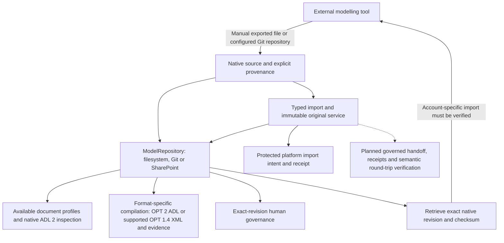

# External modelling tool integration

External tools exchange native model files with the platform's provider-neutral repository. The current implementation preserves revisions, supports Git-hosted review workflows and can compile ADL 2 and supported OET templates through the [native engine](OPT_COMPILATION.md). A complete import/handoff/semantic round-trip subsystem is being implemented against the [recorded exchange requirements](EXTERNAL_MODELLING_REQUIREMENTS.json); it must not be inferred from file storage alone.

| State | Current scope |
|---|---|
| IMPLEMENTED | Filesystem/Git/SharePoint revision contracts, native Git files, expected-revision conflicts, model retrieval/history, bounded XML diff, byte-exact originals and protected import receipts, human governance, ADL 2/OPT 2 and bounded OET/OPT 1.4 compiler profiles with saved build evidence |
| VERIFIED | Isolated repository/compiler contracts; actual independent Git-client round trip; live shared browser workspace |
| EXTERNAL_ACCEPTANCE_REQUIRED | Hosted Designer account linking, actual format import/export and round trips, account-specific automation capabilities |
| NOT SUPPORTED | Designer `.t.json` semantic editing/conversion, automatic hosted Designer push/release, complete OET compilation, governed outbound handoff bundles/receipts and full semantic reconciliation |

Solid edges represent implemented repository/compiler operations. Dotted edges remain execution work. The future `ModellingToolAdapter` contract will isolate provider-specific authentication, capability discovery and revision semantics from modelling services; no unimplemented hosted adapter is advertised as operational.

Keep original source representation separate from generated output. `model_artifact_import` preserves exact source bytes and records the actual platform principal in protected audit receipts. Source tool/version/revision and licence are separate unverified caller claims. In Git, the original is a native file with navigation metadata stored separately; editable sidecars do not establish importing identity. Do not infer equivalence from filenames or rename `.t.json` to `.oet`/`.opt`. `model_artifact_save` creates or edits ordinary draft text artefacts and cannot mutate the original namespace.

Use exact revisions for reads and `expectedRevision` for edits. A stale write is rejected; refresh the current source and inspect differences before preparing a resolution. Hosted pull-request review and clinical approval are separate. Compilation produces a DRAFT; an external tool's published status remains provenance and cannot grant internal approval.

Compatibility levels require evidence. File preservation alone can demonstrate `FILE_EXCHANGE_VERIFIED`; structural, semantic and automated-workflow levels require their corresponding real tests. Missing/stale external evidence must remain unverified. The [Designer report](ARCHETYPE_DESIGNER_COMPATIBILITY.md) records this provider-specific boundary and the [workflow guide](workflows/archetype-designer.md) gives usable current steps.

[Manual source import](MODEL_IMPORTS.md) is implemented across filesystem, Git and SharePoint, with exact bytes, type/source assurance, protected platform receipts and source downloads. Automated external-tool operations, proprietary conversion, working-copy derivation, retrospective migration and release synchronisation remain pending; this boundary does not imply hosted Designer acceptance.
