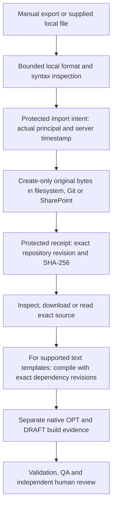

# Preserving external model originals

The assistant can import a manually exported file as an immutable original and record its platform provenance. This is useful for models received from a modelling tool, CKM, a colleague or an existing repository. It does not require a terminology server, CDR or external-tool login. It does not automate the external tool's export operation.

Three MCP operations share `Application/ModelImports`:

| Operation | Behaviour |
|---|---|
| `model_import_inspect` | Read-only format inspection of exact base64-encoded bytes. No repository writes or external requests. |
| `model_artifact_import` | Save exact bytes once and record an intent and storage receipt in the protected audit ledger. |
| `model_artifact_provenance` | Verify the recorded repository revision, hash and current original against the ledger; return the actual importing principal and separate source claims. |

`model_artifact_get` reads the original, including a historical revision. UTF-8 content without NUL is returned as `content`; binary or other encodings use `content: null`, `content_encoding: base64` and `content_base64`. `sha256` always covers the original bytes. The Models tab displays text safely, explains binary files and downloads either representation with its original filename. Downloaded content is never rendered as executable HTML.

## Workflow

1. Export from the source application using its supported workflow. Retain its filename, licence and any externally supplied revision information.
2. Base64-encode the **original bytes**, without newline normalization, XML/JSON reserialization, BOM removal or encoding conversion. Inspect using `model_import_inspect`.
3. Call `model_artifact_import` with an existing `project`, `filename`, `contentBase64`, optional `declaredType` and optional `sourceClaims`.
4. Retain the returned `import_id` and `original` reference. Verify them with `model_artifact_provenance` before further work.
5. For supported OET or ADL 2 templates, pass that exact original path/revision and dependency path/revisions to `template_compile_project`. The compiler saves a separate native OPT and build evidence; it does not change the original. Follow the [compilation profiles](OPT_COMPILATION.md) and [legacy limits](LEGACY_OPT_COMPILATION.md).

The ordinary save/delete contract rejects `originals/<import-id>/<original-filename>`. Modification requires a separate working artefact; a dedicated working-copy/derivation service remains pending. Original preservation does not imply native editing, semantic equivalence, format conversion or release synchronisation.

## Type and source assurance

The declared type vocabulary is `ADL_ARCHETYPE`, `ADL_TEMPLATE`, `OET_TEMPLATE`, `OPT`, `WEB_TEMPLATE`, `DESIGNER_AUTHORING_JSON`, `CANONICAL_COMPOSITION`, `FLAT_COMPOSITION`, `STRUCTURED_COMPOSITION`, `TERMINOLOGY_ARTEFACT`, `MODEL_PACKAGE`, `OTHER`, `UNKNOWN`. This is a classification vocabulary, not a list of implemented editors or converters.

The inspector separates `detected_type`, `declared_type`, `effective_type` and `classification_basis`. It recognizes bounded ADL header markers, known XML roots/namespaces and explicit JSON markers. XML/JSON parsing is separate from structural or openEHR conformance. ADL grammar validation is not executed by this inspector. Unknown JSON fields and original formatting are preserved. A `.t.json` filename is only a hint; it never establishes Designer origin or equivalence with OET, OPT or Web Template. A declaration that disagrees with recognized content produces `DECLARED_TYPE_CONFLICT`.

Malformed/unsafe XML or JSON is preserved with an inspection finding. Binary files, UTF-16 and packages remain opaque; archives are **not extracted**, and there is no malware-scanning claim. Imported files remain `STORED_UNREVIEWED`, `validation: NOT_EXECUTED` and `clinical_approval: false`, including files that parse successfully. Neither agents nor the import operation can approve models.

Allowed source claims are `source_system`, `tool_version`, `external_identifier`, `external_revision`, `external_status`, `exported_at`, `licence` and `copyright`. They are bounded caller declarations. Omitted source system is `UNKNOWN`; filenames and repository locations do not establish it. `external_status` preserves a source-reported release state as unverified provenance only; it cannot change the assistant lifecycle, review state or approval. There is no arbitrary source URL fetch. Unknown claim keys, caller-provided actors/timestamps/approval fields, unsafe filenames and noncanonical base64 are rejected. `exported_at` describes an unverified external assertion; the platform assigns its own request/storage timestamps.

The ledger supplies `importing_actor`. An API-key or ordinary MCP connection is a service/automation principal. The current browser chat uses its configured repository service principal; it does **not** attest the initiating browser user as the importer. Interactive human governance has a separate verified identity boundary. User-editable repository metadata cannot replace audit identity.

## Configuration and limits

Set `MODEL_REPOSITORY_WRITE_ENABLED=true` for imports, and grant the usual model-write scope/role in OIDC mode. Read-only inspection needs no write access or audit database. Persistent import requires `GOVERNANCE_ENABLED=true` and a working [PostgreSQL audit ledger](POSTGRES_AND_CACHE.md); SQLite compatibility is also supported. No new secret or import-specific environment variable is needed.

Filesystem, Git (including hosted GitHub/GitLab modes) and SharePoint implement the create-only original contract. Git stores native raw bytes in ordinary files. Filesystem and SharePoint use byte-preserving JSON envelopes within their existing snapshots. SharePoint's live tenant acceptance still requires tenant access; its isolated Graph contracts cover original preservation.

The application accepts up to 2 MiB of decoded source, subject to smaller transport/project limits. Base64 adds about one third: the default `MAX_REQUEST_BYTES=2097152` therefore permits less than 2 MiB per HTTP import. To import a full 2 MiB source over HTTP, configure `MAX_REQUEST_BYTES=4194304` consistently at ingress and application. Browser chat/tool clients may have their own smaller limits. Snapshot history consumes the configured project envelope budget; this is not bulk archive storage.

## Retry, integrity and migration boundaries

The import identifier binds tenant, project, actual requester, original filename, byte hash, declared type and sorted source claims. Repeating the same request reuses the original revision and audit events. A changed source, declaration, principal or external revision produces a distinct import.

The ledger records intent before repository storage, then a receipt after storage. These systems do not share a distributed transaction. A failed receipt leaves `STORAGE_PENDING`; retry verifies the stored bytes and completes the receipt without duplicating the original. A completed receipt pins one repository revision. External Git edits/deletions or corrupted content fail integrity checks; they cannot silently update the original's provenance.

Immutability is enforced by the application API. Administrators and independently authorized Git clients remain outside that write boundary; protect repository branches and back up both repository and ledger. Audit hash chains are integrity evidence, not protection from a root administrator replacing all storage.

Import streams are distinct from model-governance registrations. Review list pagination filters the stream type before applying limits, so imports cannot appear as reviews or be transitioned into approval. Existing ledger bytes and schema remain unchanged. Existing model artefacts are not automatically backfilled; retrospective migration/dry-run tooling remains pending and must preserve unknown origins and historical revisions.

## Verification

Run `OriginalRepositoryTest`, `ArtifactTypeInspectorTest`, `ModelImportsTest`, governance and browser tests. `scripts/test-storage-container.sh` exercises PostgreSQL filtering, persistence, actual MCP imports and rejection cases. `scripts/import-fixture-smoke.py` defaults to read-only checks; `--writes` is for an isolated synthetic test deployment. Tests cover raw Git blobs, BOM/CRLF/binary preservation, unsafe XML, idempotence, receipt-failure recovery, tenant/project isolation, forged claims, external Git tampering and exact-byte browser download.

Hosted Designer import/export, proprietary JSON conversion, semantic round-trip equivalence, migration, package extraction and release synchronisation are separate acceptance items. See the [external requirements register](EXTERNAL_MODELLING_REQUIREMENTS.json) and [completion queue](COMPLETION_QUEUE.json).
